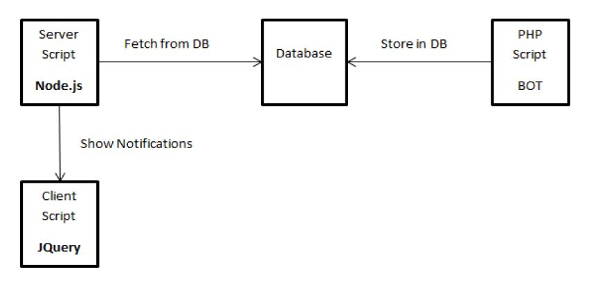

# Real-time Notification System
The objective of the project is to generate and display the notifications on the user’s screen as soon as they are generated by performing any operations inside an Enterprise Resource Planning (ERP) software.

## Description
A notification is a representation of an event that is being displayed in the form of a message.
A notification has following properties:
* A __title__.
* A __body__ (message).
* A __link__ embedded in the message.
* __Date__ and __time__ of the generated notification.
* Category-wise __image__ (if needed) for easy identification.  

### Features
The various parts of the project are summarized as follows:
* To create a list having the features of a notification system and list of operations for which the notification has to be generated.
* To setup the system for this project that includes a database to store the notification information and scripts to store data into the database and to fetch data from the database.
* To display the fetched information on the webpage in a tabular format.
* To designing an algorithm for grouping similar notifications like if 3 new orders have been created, instead of having three different notifications, it should be like this "3 orders have been created (with a link)".
* To create a session for the logged in user and display the notifications only when the user is logged in, if the user is not logged in then ask the user to login first to see the
notifications.

### Project Design
  
The explanation of the setup is as follows:
* __PHP Script__: this script will be used to create a form containing the category, message and the URL or the link for the notification. The user has to select a category and write a message. The URL box will get automatically filled up with the appropriate URL category-wise. On submitting the form, the script will create a database connection and insert the data into the table of the database.
* __Database__: this database will contain two tables, one for notifications and one for different admin users. The schema for both the tables is given in the next section.
* __Server Script__: this script will be written in Node.js to create a Pool Connection with the database and fetch the notifications form it according to the conditions specified in the query.
* __Client Script__: this script will display the data on the webpage in a tabular format.

### Technique Used
To build a real-time notification system, there are two ways of achieving the task:
* __AJAX Long Polling__: request - - >wait - - >response
* __Node.js web sockets using socket.io__: client <- - >server

Also, there are two ways get a Facebook like notification system using Web sockets:
* Using ratchet.io with PHP
* Using socket.io with node.js

In this project, the second one __socket.io__ with __node.js__ has been used to generate notification dynamically and display them on the page without loading it again and again.

This notification system uses __Synchronous communication__ to communicate with the server and the client because the data is not stored in the buffer at once rather it is transmitted at one go without any delay. Hence, in all the notification systems, mostly synchronous communication is used. Normally, __Asynchronous communication__ is used in Messaging where the message is first stored in the buffer and then it is transmitted to the user and then user can see it.

## Database Design
The real-time notification system project database consists of two tables. The name for each table along with the attributes name, data type and a short description of each attributes function is described in the following section.

Table 1: Table of Notifications
| Field Name        | Data Type           | Comments  |
| ------------- |:-------------:| -----:|
| ID      | int(5) | auto increment, not null, primary key |
| Message      | varchar(100)      |   not null |
| Datecreated | Timestamp      |    not null, default current timestamp |
| Link      | varchar(100) | not null |
| U-ID      | int(5)      |   not null |
| Category | varchar(100)      |    not null |
| Image | Blob      |    not null |

Table 2: Table of Admin Users
| Field Name        | Data Type           | Comments  |
| ------------- |:-------------:| -----:|
| u-id      | int(5) | not null, unique, primary key |
| username      | varchar(30)      |   not null, unique |
| password | varchar(32)      |    not null |